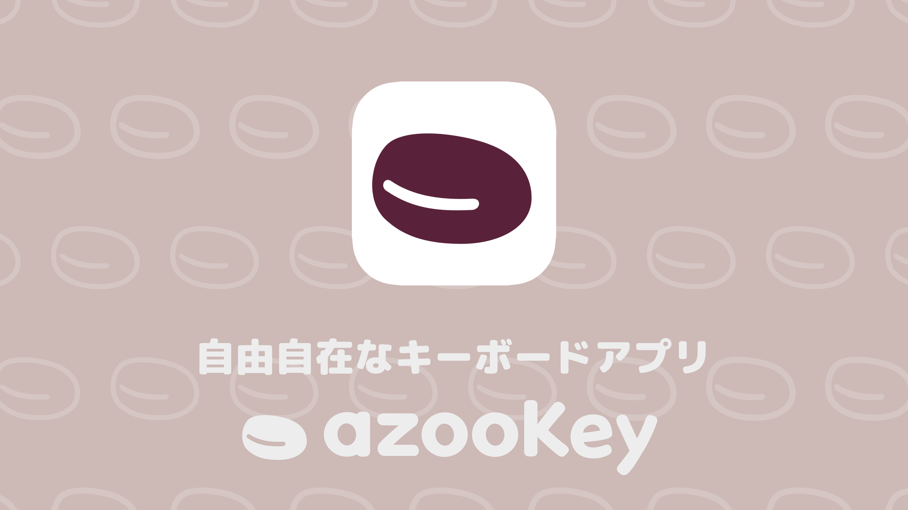
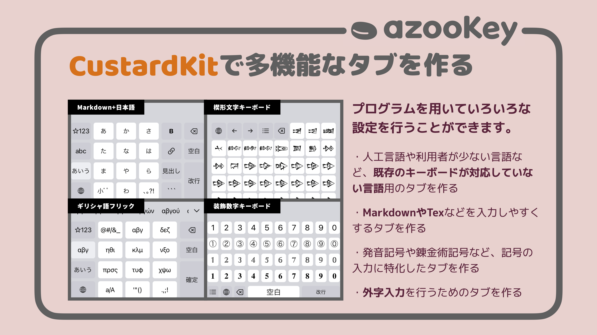

### Data
* 日本語話者(Japanese speaker)🇯🇵
* 大学2年生

### Skills
* Swiftがメイン
* Pythonがちょっと

### Interests
* 自然言語処理
* 文字コード
* フォント処理

### Works
#### azooKey - 自由自在なキーボードアプリ
  
iOS向けの日本語キーボードアプリをApp Storeで公開しています。
* [App Store](https://apps.apple.com/jp/app/id1542709230)
* [Website](https://azookey.netlify.app/)

##### CustardKit
  
azooKeyのカスタムタブを作成するためのツールキットを配布しています。
* [GitHub](https://github.com/ensan-hcl/CustardKit)

#### 発音しないチャレンジ
入力された単語をなるべく黙字で読むことで、発音せずに済ませるゲーム？です。GitHub Pagesで公開しています。
* [発音しないチャレンジ](https://ensan-hcl.github.io/NotPronouncingChallenge)

### Links
* [Qiita](https://qiita.com/ensan_hcl)
* [Zenn](https://zenn.dev/en3_hcl)
* [TechFeed](https://techfeed.io/people/@ensan)
